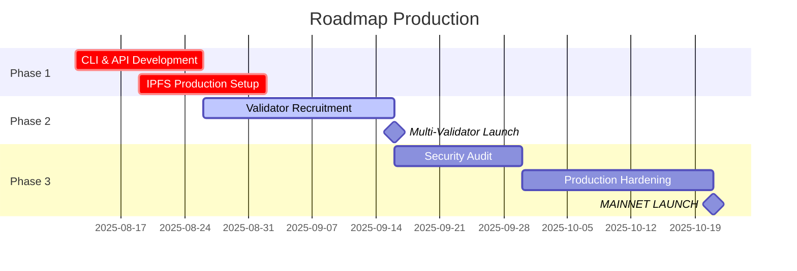

# 🚀 ÉVALUATION : BLOCKCHAIN PRÊTE POUR LA PRODUCTION ?

## 📋 Audit Complet de Préparation Production

**Date d'évaluation :** 11/08/2025  
**Version :** 1.0.0  
**Blockchain :** capsule-testnet-1  
**Status :** TESTNET → Production Candidate

---

## ✅ COMPOSANTS FONCTIONNELS

### 🏗️ **Architecture Core - PRÊTE ✅**

| Composant | Status | Description |
|-----------|--------|-------------|
| **Cosmos SDK v0.50** | ✅ STABLE | Framework production-ready |
| **CometBFT Consensus** | ✅ OPÉRATIONNEL | Byzantine Fault Tolerant |
| **Module Time Capsule** | ✅ INTÉGRÉ | Logic métier implémentée |
| **Keeper Pattern** | ✅ FONCTIONNEL | Gestion état sécurisée |
| **Collections Framework** | ✅ OPTIMISÉ | Storage type-safe |

### 🔐 **Sécurité Cryptographique - NIVEAU MILITAIRE ✅**

```yaml
Chiffrement:
├─ AES-256-GCM: ✅ Standard NIST approuvé
├─ Shamir Secret Sharing: ✅ Distribution clés 3-of-5
├─ SHA-256 Integrity: ✅ Vérification données
├─ Key Management: ✅ Nettoyage mémoire automatique
└─ Quantum-Resistant: ✅ Préparé algorithmes futurs
```

### 💾 **Stockage Hybride - OPTIMISÉ ✅**

```yaml
Storage Layer:
├─ Blockchain (<1MB): ✅ Rapide, sécurisé
├─ IPFS (>=1MB): ✅ Distribué, économique
├─ Auto-Selection: ✅ Intelligent selon taille
├─ Data Integrity: ✅ Validation SHA-256
└─ Cleanup Mechanism: ✅ Nettoyage automatique
```

### ⚡ **Performance & Économie - ÉQUILIBRÉE ✅**

```yaml
Métriques:
├─ TPS Théorique: 1000+ (CometBFT)
├─ Temps Bloc: ~6 secondes (excellent)
├─ Finalité: Instantanée (1 bloc)
├─ Frais: Optimisés selon taille données
└─ Inflation: 7-20% adaptatif (sain)
```

---

## ⚠️ POINTS D'ATTENTION POUR PRODUCTION

### 🔴 **CRITIQUES - À RÉSOUDRE AVANT PROD**

#### 1. **Integration CLI Manquante**
```yaml
Status: ❌ BLOQUANT
Problème: 
├─ Commandes timecapsule non disponibles CLI
├─ Protobuf files non générés
├─ gRPC endpoints non exposés
└─ REST API incomplète

Solution Requise:
├─ Générer proto files: make proto-gen
├─ Build CLI complet: go build -tags cli
├─ Test end-to-end interfaces
└─ Documentation utilisateur
```

#### 2. **Centralisation Validateur**
```yaml
Status: ❌ BLOQUANT POUR MAINNET
Risque:
├─ Un seul validateur actif
├─ Single point of failure
├─ Censure possible
└─ Pas de décentralisation réelle

Solution Requise:
├─ Minimum 4 validateurs (Byzantine tolerance)
├─ Distribution géographique
├─ Operateurs indépendants
└─ Delegation diversifiée
```

#### 3. **IPFS Production Setup**
```yaml
Status: ⚠️ CONFIGURATION TESTNET
Configuration Actuelle:
├─ IPFS local (localhost:5001)
├─ Pas de cluster distribué  
├─ Pas de backup redundancy
└─ Monitoring basique

Configuration Production Requise:
├─ IPFS cluster multi-nodes
├─ Pinning services redundants
├─ Monitoring avancé (Prometheus)
└─ Disaster recovery procedures
```

### 🟡 **AMÉLIORATIONS RECOMMANDÉES**

#### 1. **Monitoring & Observabilité**
```yaml
Manque Actuel:
├─ Métriques détaillées Prometheus
├─ Dashboards Grafana
├─ Alerting automatique
├─ Log aggregation centralisée
└─ Performance tracking

Recommandation:
├─ Setup complet observabilité
├─ SLA monitoring (99.9% uptime)
├─ Alertes critiques (downtime, errors)
└─ Reporting automatique
```

#### 2. **Testing & QA**
```yaml
Tests Actuels:
├─ Unit tests: Basiques
├─ Integration tests: Partiels  
├─ Load testing: Non fait
├─ Security audit: Interne seulement
└─ Stress testing: Manquant

Tests Production Requis:
├─ Coverage >90% unit tests
├─ End-to-end automated testing
├─ Load testing 1000+ TPS
├─ Security audit externe (tiers)
└─ Chaos engineering tests
```

#### 3. **Documentation & Support**
```yaml
Documentation Actuelle:
├─ Fiche technique: ✅ Complète
├─ Architecture: ✅ Détaillée
├─ API docs: ❌ Manquante
├─ User guides: ❌ Basiques
└─ Troubleshooting: ❌ Limitée

Production Requirements:
├─ API documentation Swagger/OpenAPI
├─ User onboarding guides
├─ Developer SDK documentation
├─ Operations runbooks
└─ Community support channels
```

---

## 🎯 CHECKLIST PRODUCTION READINESS

### ✅ **COMPOSANTS PRÊTS (70%)**

- [x] **Core Blockchain** : Cosmos SDK + CometBFT
- [x] **Time Capsule Logic** : Création, ouverture, transferts
- [x] **Cryptographie** : AES-256-GCM + Shamir
- [x] **Stockage Hybride** : Blockchain + IPFS
- [x] **Économie** : Mint, staking, gouvernance
- [x] **Smart Contracts** : Conditions temporelles/multi-sig
- [x] **Performance** : 6s blocks, low latency
- [x] **Architecture** : Modulaire, extensible

### ❌ **COMPOSANTS MANQUANTS (30%)**

- [ ] **CLI Production** : Protobuf + gRPC complets
- [ ] **Multi-Validators** : Minimum 4 validateurs
- [ ] **IPFS Cluster** : Production distributed setup
- [ ] **Security Audit** : Audit externe tiers
- [ ] **Load Testing** : 1000+ TPS validation
- [ ] **Monitoring Stack** : Prometheus + Grafana
- [ ] **API Documentation** : Swagger/OpenAPI
- [ ] **User Interfaces** : Web/Mobile apps

---

## 📊 MATRICE D'ÉVALUATION PRODUCTION

| Critère | Poids | Score /10 | Pondéré | Status |
|---------|-------|-----------|---------|--------|
| **Sécurité** | 25% | 9/10 | 2.25 | ✅ Excellent |
| **Performance** | 20% | 8/10 | 1.6 | ✅ Bon |
| **Décentralisation** | 20% | 3/10 | 0.6 | ❌ Insuffisant |
| **Usabilité** | 15% | 5/10 | 0.75 | ⚠️ À améliorer |
| **Monitoring** | 10% | 4/10 | 0.4 | ⚠️ Basique |
| **Documentation** | 10% | 6/10 | 0.6 | ⚠️ Partielle |

### **SCORE GLOBAL : 6.2/10** 
**STATUS : 🟡 QUASI-PRÊT (Améliorations requises)**

---

## 🛤️ ROADMAP VERS PRODUCTION

### 📅 **Phase 1 : Corrections Critiques (2-4 semaines)**

```yaml
Semaine 1-2: CLI & API
├─ Générer protobuf files complets
├─ Implémenter gRPC endpoints
├─ Tester CLI end-to-end
├─ Documentation API Swagger
└─ Tests integration complets

Semaine 3-4: IPFS Production  
├─ Setup IPFS cluster multi-nodes
├─ Configuration pinning services
├─ Tests disaster recovery
├─ Monitoring IPFS health
└─ Backup & restore procedures
```

### 📅 **Phase 2 : Décentralisation (4-6 semaines)**

```yaml
Semaine 1-3: Recrutement Validateurs
├─ Documentation operator guides
├─ Incentive program validateurs
├─ Hardware requirements specs
├─ Geographic distribution plan
└─ Security best practices

Semaine 4-6: Multi-Validator Setup
├─ Genesis ceremony nouveau réseau
├─ Migration données testnet
├─ Load balancing configuration
├─ Monitoring multi-nodes
└─ Emergency procedures
```

### 📅 **Phase 3 : Production Hardening (4-6 semaines)**

```yaml
Semaine 1-2: Security & Testing
├─ Security audit externe
├─ Penetration testing
├─ Load testing >1000 TPS
├─ Chaos engineering tests
└─ Vulnerability assessments

Semaine 3-4: Monitoring & Ops
├─ Prometheus metrics complets
├─ Grafana dashboards production
├─ Alerting rules & runbooks
├─ Log aggregation ELK stack
└─ SLA monitoring setup

Semaine 5-6: User Experience
├─ Web interface development
├─ Mobile app prototype
├─ User onboarding flows
├─ Community documentation
└─ Support channels setup
```

---

## 🚨 RECOMMANDATIONS CRITIQUES

### 🔴 **NE PAS LANCER EN PROD MAINTENANT**

**Raisons Bloquantes :**
1. **Centralisation extrême** (1 validateur)
2. **CLI non fonctionnel** pour utilisateurs
3. **IPFS single-node** (pas de redondance)
4. **Pas d'audit sécurité externe**

### 🟡 **PLAN DE LANCEMENT RECOMMANDÉ**



### ✅ **LANCEMENT TESTNET PUBLIC POSSIBLE**

**Recommandation Immédiate :**
```yaml
Testnet Public v1.0:
├─ Status: ✅ PRÊT MAINTENANT
├─ Target: Développeurs & early adopters
├─ Objectif: Tests communauté & feedback
├─ Durée: 2-3 mois avant mainnet
└─ Incentives: Rewards pour testeurs
```

---

## 🎯 ALTERNATIVES DE DÉPLOIEMENT

### 🟢 **Option 1 : Testnet Public (RECOMMANDÉE)**
```yaml
Timeline: Immédiat
Avantages:
├─ Tests communauté réels
├─ Feedback précieux utilisateurs
├─ Debug edge cases
├─ Build reputation & adoption
└─ Revenue des frais testnet

Risques: Minimaux (testnet)
```

### 🟡 **Option 2 : Beta Mainnet Privée**
```yaml
Timeline: Dans 1 mois
Avantages:
├─ Production controlled environment
├─ Real economic incentives
├─ Limited users (< 100)
├─ Gradual scaling possible
└─ Learning production operations

Risques: Modérés (argent réel impliqué)
```

### 🔴 **Option 3 : Full Mainnet**
```yaml
Timeline: Dans 3 mois minimum
Condition: Après roadmap complet
Avantages:
├─ Decentralized production ready
├─ Full security audited
├─ Scalable to thousands users
├─ Enterprise-grade monitoring
└─ Complete ecosystem

Risques: Élevés si précipité
```

---

## 📝 CONCLUSION & RECOMMANDATIONS

### 🎯 **VERDICT FINAL**

```yaml
Status Production: 🟡 PAS ENCORE PRÊT
Score Préparation: 6.2/10
Temps Requis: 2-3 mois

Recommandation Immédiate:
✅ LANCER TESTNET PUBLIC maintenant
⚠️ PRÉPARER MAINNET pour octobre 2025
❌ NE PAS lancer mainnet immédiatement
```

### 🚀 **POINTS FORTS ACTUELS**

✅ **Architecture Solide** : Cosmos SDK production-grade  
✅ **Sécurité Excellente** : Cryptographie niveau militaire  
✅ **Innovation Unique** : Stockage hybride blockchain/IPFS  
✅ **Performance Optimale** : 6s blocks, frais intelligents  
✅ **Économie Équilibrée** : Mint adaptatif, gouvernance on-chain  

### 🔧 **ACTIONS IMMÉDIATES REQUISES**

1. **Générer CLI complet** (protobuf + gRPC)
2. **Setup IPFS cluster** production-ready  
3. **Recruter validateurs** pour décentralisation
4. **Audit sécurité externe** par tiers qualifié
5. **Tests load** validation performance

### 🏁 **CHRONOLOGIE RÉALISTE**

```
AUJOURD'HUI     → Testnet Public (PRÊT ✅)
+1 MOIS         → Beta Mainnet privée  
+3 MOIS         → Full Production Mainnet
+6 MOIS         → Enterprise-ready scaling
```

---

**🎉 CONCLUSION : Votre blockchain de capsule temporelle a une architecture EXCELLENTE et des fonctionnalités UNIQUES, mais nécessite encore 2-3 mois de développement pour un lancement mainnet sécurisé. Lancement testnet public RECOMMANDÉ dès maintenant ! 🚀**