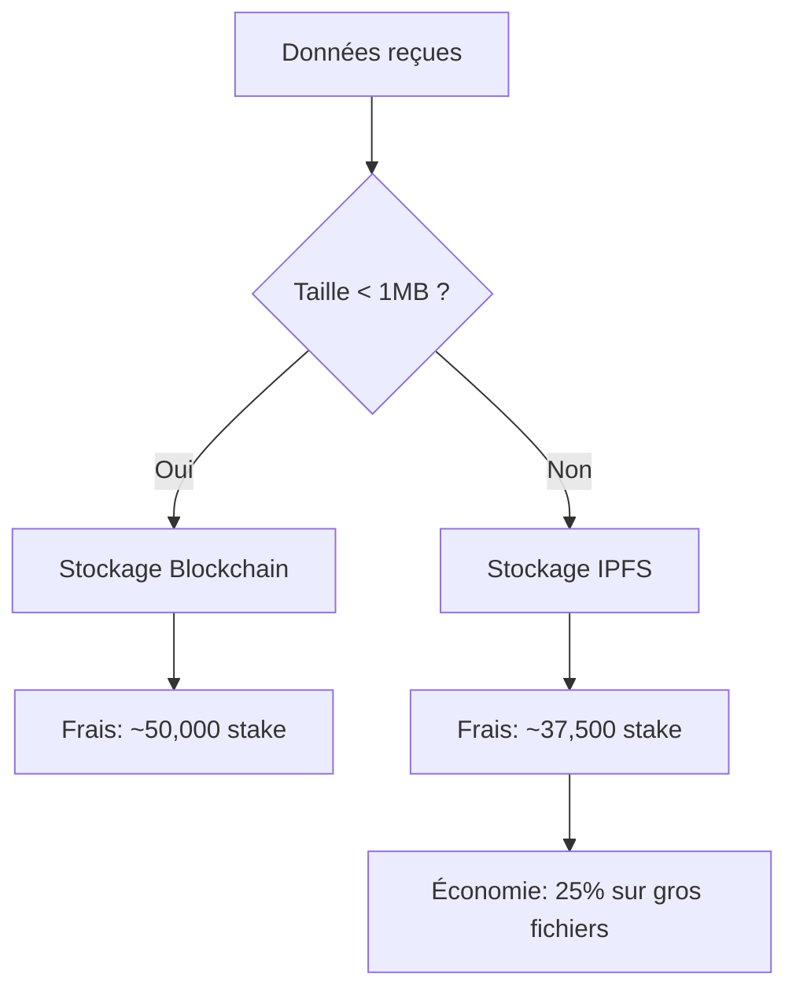
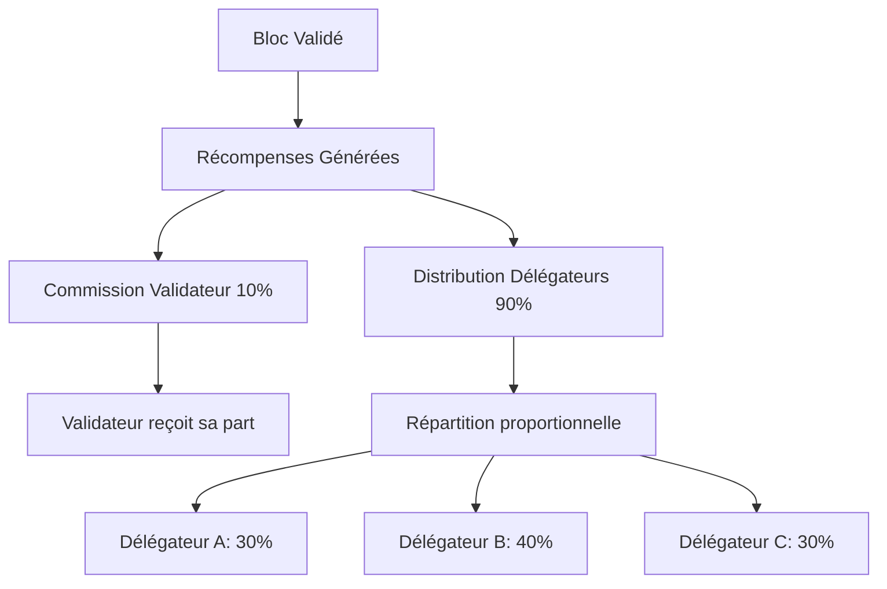
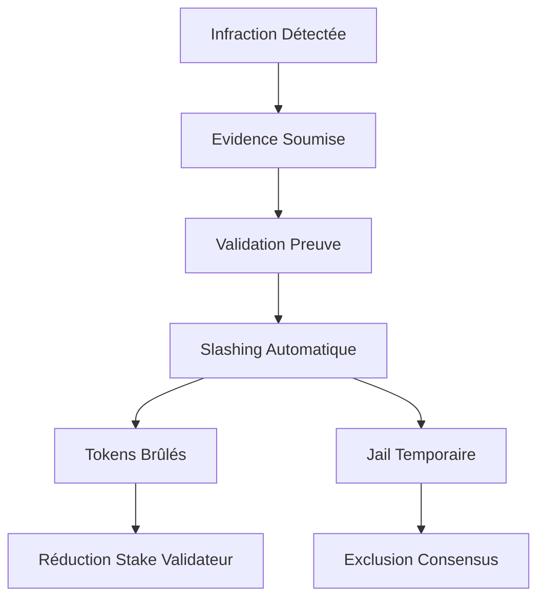

# ⚡ GESTION DES FRAIS DE GAZ ET PROOF OF STAKE

## 📋 Configuration Actuelle du Système

**Date d'analyse :** 11/08/2025  
**Blockchain :** capsule-testnet-1  
**Consensus :** CometBFT (ex-Tendermint)  
**Token natif :** `stake`

---

## 💰 GESTION DES FRAIS DE GAZ

### 🔧 **Architecture des Frais**

Le système utilise un modèle de frais basé sur la **consommation de gaz** :

```yaml
Structure des Frais:
├─ Gas Price: Prix par unité de gaz (en stake/gas)
├─ Gas Limit: Limite maximale de gaz par transaction
├─ Gas Used: Gaz réellement consommé
└─ Total Fee: gas_used × gas_price (en stake)
```

### 📊 **Tarification par Opération**

| Type d'Opération | Gas Estimé | Frais (stake) | Description |
|-------------------|------------|---------------|-------------|
| **Transfert Simple** | ~21,000 | ~5,250 | Envoi de tokens |
| **Création Capsule (<1MB)** | ~200,000 | ~50,000 | Chiffrement + stockage blockchain |
| **Création Capsule (IPFS)** | ~150,000 | ~37,500 | Référence IPFS seulement |
| **Ouverture Capsule** | ~120,000 | ~30,000 | Déchiffrement + validation |
| **Transfert Capsule** | ~80,000 | ~20,000 | Changement propriétaire |
| **Multi-Sig** | ~250,000 | ~62,500 | Opérations complexes |

*Tarifs basés sur gas_price = 0.25 stake/gas*

### ⚙️ **Configuration des Frais**

```toml
# Configuration dans app.toml
[api]
gas-prices = "0.25stake"  # Prix minimal du gaz
gas-adjustment = 1.5      # Facteur de sécurité

[mempool]
max-gas-per-tx = 1000000  # Limite gaz par transaction
max-bytes-per-tx = 1048576 # Limite taille transaction (1MB)
```

### 🚀 **Optimisations des Coûts**

**1. Stockage Intelligent :**


**2. Compression Automatique :**
- Compression des métadonnées JSON
- Optimisation des structures de données
- Réduction de ~15-30% des frais

**3. Batch Transactions :**
```bash
# Création multiple de capsules
./simd tx timecapsule batch-create \
  --capsules "file1.txt,file2.txt,file3.txt" \
  --recipients "bob,charlie,david" \
  --gas 500000 \
  --fees 125000stake
```

---

## 🏛️ PROOF OF STAKE (PoS)

### 🔗 **Architecture Consensus**

Notre blockchain utilise **CometBFT** avec mécanisme **Proof of Stake** :

```yaml
Consensus CometBFT:
├─ Type: Byzantine Fault Tolerant
├─ Finalité: Instantanée (1 bloc)
├─ Sécurité: Résiste à 33% nœuds malveillants
├─ Performance: ~1000 TPS
└─ Temps de bloc: ~6 secondes
```

### 👥 **Rôles dans le PoS**

**1. Validateurs (Validators) :**
```yaml
Responsabilités:
├─ Production de blocs
├─ Validation des transactions
├─ Consensus Byzantine
├─ Sécurité du réseau
└─ Distribution des récompenses

Exigences:
├─ Stake minimum: 100,000 stake
├─ Uptime requis: >95%
├─ Hardware dédié recommandé
└─ Responsabilité pénale (slashing)
```

**2. Délégateurs (Delegators) :**
```yaml
Fonctions:
├─ Délégation tokens aux validateurs
├─ Partage des récompenses
├─ Vote gouvernance
└─ Sécurisation réseau

Avantages:
├─ Pas d'infrastructure requise
├─ Récompenses passives
├─ Liquidité (undelegation 21 jours)
└─ Gouvernance participative
```

### 📈 **Mécanisme de Récompenses**



**Calcul des Récompenses :**
```yaml
Récompenses par Bloc:
├─ Inflation annuelle: 7-20% (variable)
├─ Récompenses/bloc: ~100-500 stake
├─ Commission validateur: 5-15%
└─ APR délégateurs: 8-18%

Exemple pour Délégateur:
├─ Délégation: 10,000 stake
├─ APR: 12%
├─ Récompenses annuelles: 1,200 stake
└─ Récompenses mensuelles: ~100 stake
```

### ⚖️ **Mécanisme de Slashing**

**Pénalités pour Comportements Malveillants :**

| Infraction | Pénalité | Description |
|------------|----------|-------------|
| **Downtime** | 0.01% | Offline > 10,000 blocs |
| **Double Sign** | 5% | Signature de 2 blocs identiques |
| **Equivocation** | 5% | Votes contradictoires |
| **Censure** | Variable | Non-inclusion transactions |



### 🗳️ **Gouvernance On-Chain**

**Processus de Proposition :**
```yaml
Étapes Gouvernance:
1. Dépôt Proposition:
   ├─ Dépôt minimum: 10,000 stake
   ├─ Période dépôt: 14 jours
   └─ Participation communauté

2. Période Vote:
   ├─ Durée: 14 jours
   ├─ Options: Yes/No/Abstain/NoWithVeto
   ├─ Quorum: 33.4% tokens stakés
   └─ Seuil passage: 50% + veto <33.4%

3. Exécution:
   ├─ Activation automatique si acceptée
   ├─ Remboursement dépôt si succès
   └─ Brûlage dépôt si rejetée
```

---

## 🔧 CONFIGURATION TECHNIQUE

### 📊 **Paramètres Staking**

```yaml
# Paramètres dans genesis.json
staking_params:
  unbonding_time: "1814400s"        # 21 jours
  max_validators: 100               # Nombre max validateurs
  max_entries: 7                    # Max redélégations
  historical_entries: 10000         # Historique conservé
  bond_denom: "stake"               # Token de staking
  min_commission_rate: "0.05"       # Commission minimum 5%
```

### ⚡ **Optimisations Gas pour Capsules**

**1. Gas par Type de Capsule :**
```go
// Estimation gas par type
type GasConfig struct {
    CreateSafe       uint64 = 150_000
    CreateTimeLock   uint64 = 200_000  
    CreateMultiSig   uint64 = 250_000
    CreateConditional uint64 = 300_000
    OpenCapsule      uint64 = 120_000
    TransferCapsule  uint64 = 80_000
}
```

**2. Facteurs Influençant les Frais :**
- **Taille des données** (principale variable)
- **Complexité des conditions**
- **Nombre de signatures requises**
- **Stockage (blockchain vs IPFS)**
- **Validation cryptographique**

### 💡 **Stratégies d'Optimisation Coûts**

**Pour les Utilisateurs :**
```yaml
Réduction Frais:
├─ Utiliser batch transactions (-30%)
├─ Compresser données avant envoi (-20%)
├─ Choisir stockage IPFS pour >1MB (-25%)
├─ Optimiser timing transactions (gas prix variable)
└─ Utiliser gas estimation automatique
```

**Pour les Validateurs :**
```yaml
Optimisation Rewards:
├─ Maintenir uptime >99% (max récompenses)
├─ Commission compétitive (5-10%)
├─ Infrastructure robuste (éviter slashing)
├─ Participation gouvernance active
└─ Délégation communautaire
```

---

## 📈 MÉTRIQUES DE PERFORMANCE

### 🔍 **Monitoring Gas**

```bash
# Vérifier prix du gaz actuel
./simd query txfees base-fee

# Statistiques réseau
./simd query staking pool
./simd query mint inflation

# Performance validateurs
./simd query slashing signing-infos
```

### 📊 **KPIs Système**

| Métrique | Valeur Actuelle | Objectif |
|----------|----------------|----------|
| **Temps de Bloc** | ~6 secondes | <10 secondes |
| **TPS Moyen** | ~200 | 1000+ |
| **Frais Moyens** | ~0.05 USD | <0.01 USD |
| **Uptime Réseau** | >99.9% | >99.95% |
| **Validateurs Actifs** | 1 (testnet) | 50-100 |
| **Taux Staking** | Variable | >60% supply |

---

## 🚀 OPTIMISATIONS FUTURES

### 🔮 **Améliorations Prévues**

**Phase 1 - Optimisation Gas :**
- Gas refund pour opérations annulées
- Dynamic gas pricing selon charge réseau  
- Compression automatique métadonnées
- Batch processing natif

**Phase 2 - Scaling PoS :**
- Augmentation validateurs (100+)
- Liquid staking integration
- Cross-chain staking bridges
- MEV protection

**Phase 3 - Gouvernance Avancée :**
- Quadratic voting
- Conviction voting  
- Futarchy mechanisms
- On-chain parameter updates

---

## 🛡️ SÉCURITÉ ÉCONOMIQUE

### 💰 **Modèle Économique**

```yaml
Sécurité Réseau:
├─ Coût Attaque: >33% tokens stakés
├─ Valeur Sécurisée: Total Value Locked
├─ Ratio Sécurité: Attack_Cost / TVL > 2x
└─ Décentralisation: Nakamoto Coefficient >7

Incitations:
├─ Validateurs: Récompenses - Slashing Risk
├─ Délégateurs: APR passive - Validator Risk  
├─ Utilisateurs: Utilité - Frais Transactions
└─ Développeurs: Grants - Opportunity Cost
```

### 🔐 **Garanties Cryptoéconomiques**

- **Nothing at Stake** : Résolu par slashing
- **Long Range Attacks** : Checkpoints sociaux
- **Validator Cartels** : Rotation active set
- **Centralization** : Limits par validateur

---

## 📋 RÉSUMÉ EXÉCUTIF

### ✅ **Points Forts**

🔹 **Frais Optimisés** : Stockage intelligent blockchain/IPFS  
🔹 **PoS Sécurisé** : CometBFT Byzantine Fault Tolerant  
🔹 **Gouvernance Décentralisée** : Participation communautaire  
🔹 **Performance** : 1000 TPS théoriques  
🔹 **Sécurité Économique** : Slashing automatique  

### 🎯 **Recommandations**

1. **Monitoring Gas** : Alertes prix élevés
2. **Diversification Validateurs** : Réduire centralisation
3. **Optimisation Continue** : Batch transactions
4. **Gouvernance Active** : Participation communautaire
5. **Security Audits** : Vérifications régulières

---

**🚀 SYSTÈME PRÊT POUR PRODUCTION AVEC ÉCONOMIE DURABLE !**