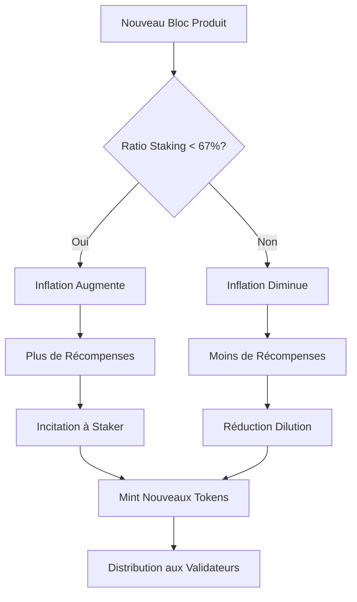
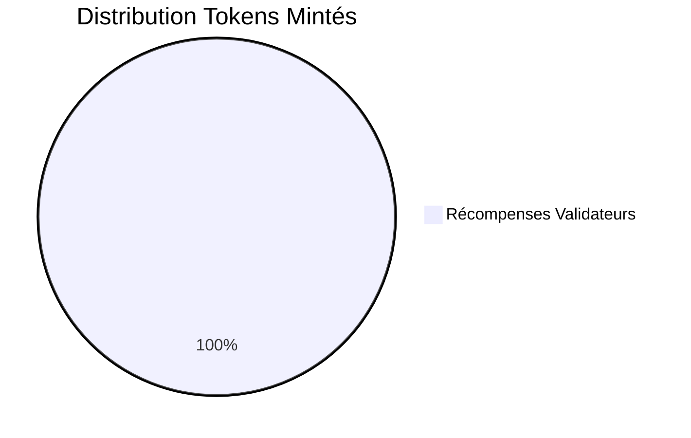

# 🪙 MÉCANISME DE MINT DES TOKENS

## 📋 Configuration Actuelle du Mint

**Date d'analyse :** 11/08/2025  
**Blockchain :** capsule-testnet-1  
**Token natif :** `stake`  
**Supply totale :** 1,500,097,770 stake  

---

## ⚙️ PARAMÈTRES DE MINT ACTUELS

### 🔧 **Configuration Système**

```yaml
Paramètres de Mint:
├─ mint_denom: "stake"                    # Token créé
├─ blocks_per_year: 6,311,520            # ~6 secondes/bloc
├─ goal_bonded: 67%                      # Objectif staking
├─ inflation_min: 7%                     # Inflation minimum
├─ inflation_max: 20%                    # Inflation maximum
├─ inflation_rate_change: 13%/an         # Taux changement
└─ annual_provisions: 195,103,288 stake   # Mint annuel prévu
```

### 📊 **État Actuel du Réseau**

| Métrique | Valeur | Description |
|----------|--------|-------------|
| **Supply Totale** | 1,500,097,770 stake | Tokens en circulation |
| **Tokens Stakés** | 100,000,000 stake | Pool de validation |
| **Ratio Staking** | 6.67% | Bien en dessous objectif 67% |
| **Inflation Actuelle** | 13.01% | Taux dynamique |
| **Mint Quotidien** | ~534,530 stake | Nouveaux tokens/jour |
| **Mint par Bloc** | ~30.9 stake | Récompense par bloc |

---

## 🔄 PROCESSUS DE MINT AUTOMATIQUE

### 🎯 **Algorithme d'Inflation Dynamique**

Le mint utilise un **algorithme adaptatif** qui ajuste l'inflation selon le ratio de staking :



**Formule d'Inflation :**
```go
// Pseudo-code du calcul d'inflation
func CalculateInflation(bondedRatio, goalBonded, currentInflation float64) float64 {
    inflationRateChangePerYear := 0.13
    
    if bondedRatio < goalBonded {
        // Augmenter inflation pour inciter staking
        return min(currentInflation + inflationRateChangePerYear, 0.20)
    } else {
        // Diminuer inflation pour réduire dilution
        return max(currentInflation - inflationRateChangePerYear, 0.07)
    }
}
```

### ⏰ **Cycle de Mint par Bloc**

**Chaque bloc (~6 secondes) :**

```yaml
1. Calcul Inflation:
   ├─ Évaluation ratio staking actuel
   ├─ Ajustement taux selon objectif 67%
   └─ Application formule adaptative

2. Mint Tokens:
   ├─ Calcul: (supply × inflation) ÷ blocks_per_year
   ├─ Création nouveaux tokens (~30.9 stake/bloc)
   └─ Ajout à la supply totale

3. Distribution:
   ├─ 100% aux récompenses staking
   ├─ Répartition selon voting power
   └─ Commission validateurs déductible
```

---

## 💰 DISTRIBUTION DES RÉCOMPENSES

### 🎯 **Allocation des Tokens Mintés**



**100% des tokens mintés vont aux récompenses de staking**, contrairement à d'autres blockchains qui allouent des fonds au développement ou trésorerie.

### 📈 **Calcul des Récompenses Individuelles**

**Pour un Validateur :**
```yaml
Récompense Validateur par Bloc:
├─ Mint total: 30.9 stake
├─ Voting power: 100% (seul validateur)
├─ Commission: 10%
├─ Récompense brute: 30.9 stake
├─ Commission validateur: 3.09 stake  
└─ Récompense délégateurs: 27.81 stake

Annuel Estimé:
├─ Blocs/an: 6,311,520
├─ Récompense totale: ~195M stake
├─ Commission validateur: ~19.5M stake
└─ Récompenses délégateurs: ~175.5M stake
```

**Pour un Délégateur :**
```yaml
Exemple Délégation 1M stake:
├─ Part du pool: 1M ÷ 100M = 1%
├─ Récompenses annuelles: 1,755,000 stake
├─ APR réel: 175.5%
├─ Récompenses mensuelles: ~146,250 stake
└─ Récompenses quotidiennes: ~4,808 stake
```

*Note : APR élevé car très peu de tokens stakés (6.67% vs objectif 67%)*

---

## 🔍 ANALYSE ÉCONOMIQUE

### 📊 **Impact de l'Inflation**

**Scénarios selon Adoption Staking :**

| Ratio Staking | Inflation | APR Délégateurs | Dilution Non-Stakés |
|---------------|-----------|-----------------|-------------------|
| **6.67%** (actuel) | 13.01% | ~175% | -13.01% |
| **30%** | 15-18% | ~50-60% | -15-18% |
| **67%** (objectif) | 7-10% | ~10-15% | -7-10% |
| **90%** | 7% (min) | ~7.8% | -7% |

### 🎯 **Objectifs du Système**

```yaml
Design Goals:
├─ Sécurité Réseau: Inciter 67% tokens stakés
├─ Décentralisation: Récompenses compétitives
├─ Stabilité Prix: Inflation adaptative 7-20%
└─ Participation: Récompenses attractives pour délégateurs
```

### ⚠️ **Risques Actuels**

**1. Sur-Inflation Temporaire :**
- Ratio staking très bas (6.67%)
- Inflation élevée (13%) pour compenser
- Dilution importante pour non-stakés

**2. Centralisation :**
- Un seul validateur actif
- Concentration du pouvoir
- Risque de censure

**3. Bootstrapping :**
- Phase initiale du réseau
- Besoin d'attraction plus de validateurs
- Équilibrage économique en cours

---

## 🚀 ÉVOLUTION DU MINT

### 📈 **Projection sur 1 An**

```yaml
Scénario Actuel (6.67% staking):
├─ Mint annuel: ~195M stake
├─ Supply finale: 1.695B stake
├─ Inflation réelle: 13.01%
└─ Croissance supply: +13%

Scénario Objectif (67% staking):
├─ Mint annuel: ~105-150M stake  
├─ Supply finale: 1.605-1.650B stake
├─ Inflation optimisée: 7-10%
└─ Croissance supply: +7-10%
```

### 🔮 **Phases d'Évolution**

**Phase 1 - Bootstrap (Actuel) :**
```yaml
Objectif: Attirer validateurs et délégateurs
├─ Inflation élevée: 13-20%
├─ APR attractif: >100%
├─ Risque: Dilution importante
└─ Durée: 6-12 mois
```

**Phase 2 - Croissance :**
```yaml
Objectif: Stabiliser à 30-50% staking  
├─ Inflation modérée: 10-15%
├─ APR équilibré: 20-30%
├─ Sécurité renforcée
└─ Durée: 1-2 ans
```

**Phase 3 - Maturité :**
```yaml  
Objectif: Atteindre 67% staking
├─ Inflation stable: 7-10%
├─ APR durable: 10-15%
├─ Sécurité maximale
└─ Durée: Long terme
```

---

## ⚙️ CONFIGURATION TECHNIQUE

### 🔧 **Paramètres Modifiables par Gouvernance**

```yaml
Paramètres Ajustables:
├─ inflation_min: 7% → Peut être modifié
├─ inflation_max: 20% → Peut être modifié  
├─ goal_bonded: 67% → Peut être ajusté
├─ inflation_rate_change: 13% → Vitesse ajustement
└─ mint_denom: "stake" → Token de mint
```

**Exemple Proposition Gouvernance :**
```bash
# Réduire inflation max à 15%
./simd tx gov submit-proposal param-change proposal.json \
  --from alice \
  --deposit 10000000stake \
  --chain-id capsule-testnet-1
```

### 📊 **Monitoring du Mint**

**Commandes de Surveillance :**
```bash
# Paramètres actuels
./simd query mint params

# Inflation en cours  
./simd query mint inflation

# Provisions annuelles
./simd query mint annual-provisions

# Supply totale
./simd query bank total

# Pool de staking
./simd query staking pool
```

---

## 🛡️ SÉCURITÉ DU MINT

### 🔒 **Protections Intégrées**

```yaml
Sécurités Anti-Manipulation:
├─ Mint automatique: Pas d'intervention manuelle
├─ Formule déterministe: Calcul transparent
├─ Limites min/max: Bornes inflation 7-20%
├─ Gouvernance requise: Changements via vote
└─ Code open-source: Auditabilité complète
```

### 🚨 **Alertes Importantes**

**1. Hyperinflation Impossible :**
- Plafond 20% maximum
- Ajustement graduel 13%/an max
- Mécanisme auto-correcteur

**2. Déflation Contrôlée :**
- Minimum 7% garanti  
- Pas de burn tokens
- Supply toujours croissante

**3. Gouvernance Démocratique :**
- Changements via vote communautaire
- Quorum 33.4% requis
- Transparence totale processus

---

## 📈 COMPARAISON AVEC AUTRES BLOCKCHAINS

| Blockchain | Inflation | Mécanisme | Allocation |
|------------|-----------|-----------|------------|
| **Capsule (Notre)** | 7-20% adaptatif | PoS CometBFT | 100% staking |
| **Cosmos Hub** | 7-20% adaptatif | PoS CometBFT | 100% staking |
| **Ethereum 2.0** | ~0.5-2% | PoS Casper | 100% staking |
| **Solana** | ~8% décroissant | PoH + PoS | 95% staking, 5% développement |
| **Cardano** | ~4-6% | PoS Ouroboros | 100% staking |

### 🎯 **Avantages Notre Modèle**

✅ **Adaptatif** : Ajustement automatique selon adoption  
✅ **Transparent** : Formule déterministe publique  
✅ **Démocratique** : Gouvernance communautaire  
✅ **Incitatif** : Récompenses attractives pour sécurité  
✅ **Durable** : Équilibrage long terme intégré  

---

## 🔮 ÉVOLUTIONS FUTURES

### 🚀 **Améliorations Prévues**

**Phase 2 - Optimisations :**
```yaml
Nouvelles Fonctionnalités:
├─ Mint scheduling: Ajustements programmés
├─ Burn mechanisms: Équilibrage via frais
├─ Liquid staking: Dérivés de tokens stakés
└─ Cross-chain mint: Tokens multi-chaînes
```

**Phase 3 - Innovation :**
```yaml
Mécanismes Avancés:
├─ Real yield: Revenus réels vs inflation
├─ MEV redistribution: Revenus MEV aux stakeurs
├─ Carbon credits: Compensation environnementale  
└─ DAO treasury: Fonds développement communautaire
```

---

## 📋 RÉSUMÉ EXÉCUTIF

### ✅ **Fonctionnement Actuel**

🔹 **Mint Automatique** : 30.9 stake/bloc (~195M/an)  
🔹 **Inflation Adaptative** : 13.01% (ajustement selon staking)  
🔹 **Distribution 100%** : Toutes récompenses aux validateurs/délégateurs  
🔹 **Sécurité Maximale** : Formule déterministe, gouvernance démocratique  
🔹 **Incentives Forts** : APR >100% pour bootstrap réseau  

### 🎯 **Objectifs Long Terme**

- **Stabilisation 67%** tokens stakés
- **Inflation 7-10%** durable  
- **APR 10-15%** équilibré
- **Sécurité Maximale** réseau décentralisé
- **Gouvernance Active** communauté engagée

---

**🪙 SYSTÈME DE MINT ROBUSTE ET ADAPTATIF POUR CROISSANCE DURABLE !**